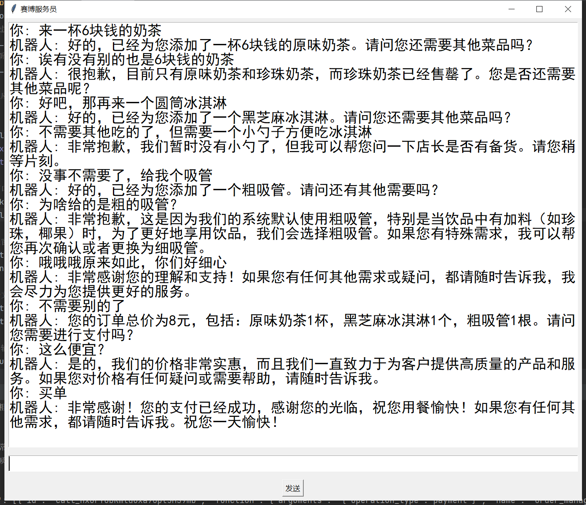

# 赛博服务员

这是一个用GPT扮演的餐馆服务员，可以实现菜品介绍，点菜，所需用餐物品（如纸巾吸管等）的递送。

这是一个技术验证项目，用于验证LLM在信息缺失情况下，主动向用户提问的技术。

本项目中，AI服务员被赋予了“呼叫上级”的功能，当AI认为该问题棘手或超出自身处理权限时，会选择通知“上级”，由人类给予解决方案。

当AI从上级那里获得了方案后，可以自动从中学习，将对应的处理方案存储于长期记忆中，可以逐步减少对人类的依赖。


# 基础配置

## 环境配置

本人的开发环境为python 3.8.3

安装下列包

```
openai==1.3.4
tqdm
numpy
pandas
httpx
```

设置代理

代理为127.0.0.1:7890

（如果有直连环境，修改llm/gpt.py中的部分即可）

设置环境变量OPENAI_API_KEY


## 菜谱配置

数据在data/menu.xlsx中，该文件存储了菜谱和餐桌用品的数据。

可以参考样例菜谱中的填写方式。

注意，餐桌用品（如纸巾吸管等）也填写在“菜单”列表中。

注意，对于.embe和.sha256两个文件，无需手动生成，该部分是菜谱的向量数据库文件，当菜谱出现了修改时，.embe文件会自动更新。


# 运行

直接python main.py即可

下面是一个运行截图

